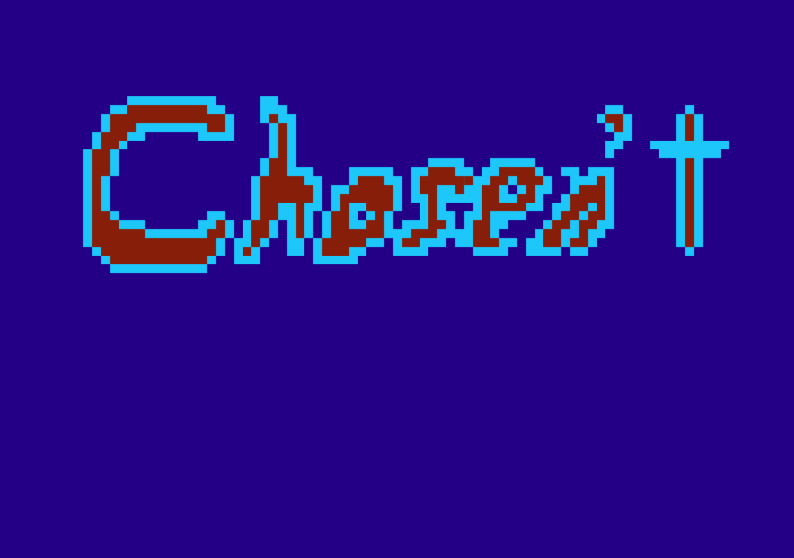

# Chosen't
A game where you're the one who *wasn't* Chosen. Built in 24 hours for the **ConUHacks VII Hackathon** at Concordia University in Montreal, Quebec, Canada.

In this 2D top-down tower defense-esque game, inspired by the tabletop game `Boss Monsters`, you play as the traditional enemy: The Chosen't. Your goal is to send your hoards of minions to defeat the Chosen before he reaches you at the end of the maze, but be careful! The Chosen is cunning and uses intelligent pathing algorithms to get to you most efficiently.
